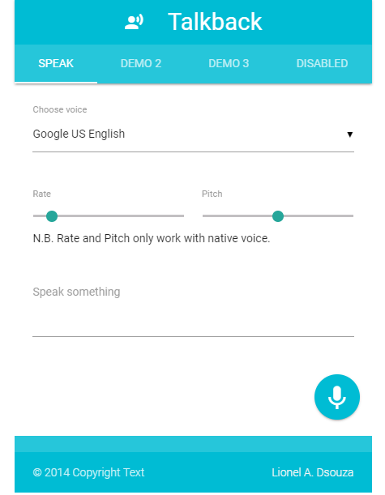

# Talkback

Web Speech API - Demo App

This project is a demo application which leverages Web Speech API of Browser.

## How to check the demo

Run the index.html file on browser, make sure you are online, since the demo uses CDN libraries.

## Further reading

To get more help on the Web Speech API, chek the documenttation on MDN.
(https://developer.mozilla.org/en-US/docs/Web/API/Web_Speech_API).

## MDN Github speech recognition 
web-speech-api : (https://github.com/mdn/web-speech-api/)
